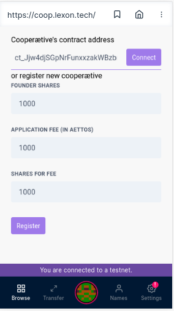
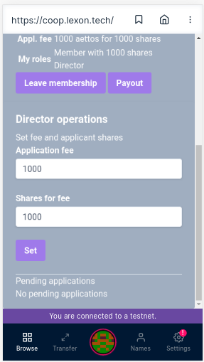
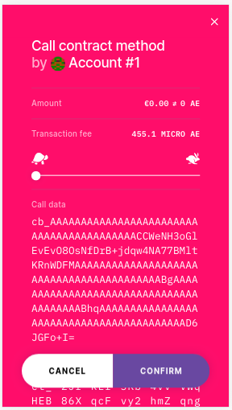
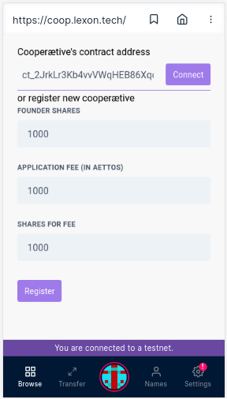
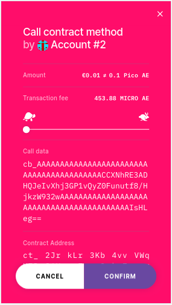
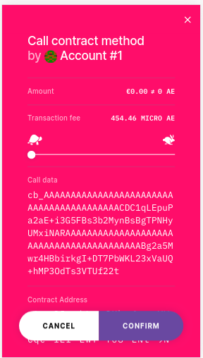

#### Step 1 Open the base aepp

First of all make sure that you're connected to the testnet. Then click click on `Browse`.

#### Step 2 Connect with the aepp

Enter `https://coop.lexon.tech` in the URL bar.

#### Step 3 Register a new cooperætive

In the start screen you can either:
* Connect to an existing cooperætive
* Register a new cooperætive

The URL has a default contract address of an already deployed demo cooperætive with three members.

In this demo we'll now register a brand new cooperætive company. To from a new cooperætive three details are required:
* The amount of shares you (the founder) will take
* The default fee that new members will pay (the amount is in aettos as long as we're on the testnet)
* The amount of shares new members receive in return for their contribution

Enter your own values or accept the default values of 1000 aettos divided into 1000 shares. Click `Register` to start the registration process.

##### Step 4 Pay the capital and contract deployment fee.

Now it's time to pay. Notice that you'll pay the share capital (Amount) and the gas fee. Registering a cooperætive is in fact deploying a smart contract on the æternity blockchain. Click on `Confirm` to continue. Hold on for a few seconds while the registration takes place.

#### Step 5 Information about your new cooperætive

Congratulations! You're now director and member of a brand new cooperætive. 

In the first part of the screen you can see all the general details of the company, including your roles. This is also the screen where you'd end up after entering a contract address and clicking connect in step 3.

First copy the value which starts with `ck_` in the contract address field. This is the unique contract number of your cooperætive. We'll need this address later, so make sure you coptied it. 

#### Step 6 Director operations

As a director you have some extra options, which normal members don't have. For now you can:
* Change the registration fee and shares for new members
* Approve/reject membership applications (we'll look at this later)

Let's change the conditions for new members. Change the value for application fee to 100000 or another value and click `Set`

#### Step 7 Changing conditions for new members

Click `confirm` to commit the change to the blockchain. Notice that `amount` is now 0, that's because we're not paying any fees, but only gas for the transaction.

#### Step 8 New state

As you can see the state of the contract has changed and contains the values we set in step 7.

Let's now apply for membership. For this we'll need to use another account.

#### Step 9 Loading the contract

First click on the `Cooperætive contract address` field and pase the contract address you copied in step 5. Then click `Connect`.

#### Step 10 Applying for membership

The screen shows the general details of the company. Click on `Apply for membership`.

#### Step 11 Confirm and pay

You'll now see the screen to confirm the transaction and to pay the membership contribution. Click on `Confirm` to continue.

#### Step 12 Application pending

Everything went well and your membership is now pending. Once a director approves it you're a member. In case a director would reject your membership the smart contract will automatically return the member contribution you paid as stipulated in the contract.

For now we'll switch back to the first account, which is a director's account to approve the membership. After switching accounts, you'll have to load the contract again by pasting the contract addres and clicking `Connect`.

#### Step 13 Pending memberships

Back in the director's account you can see the pending membership application. Click on `Approve`.

#### Step 14 Confirm

Again we need to confirm the transaction.

#### Step 15 Updated state

The state of the contract is updated and our cooperætive has already 2 members.

By the way: If you click on `View transaction` in the status messages you'll be forwarded to the blockchain explorer and you can check the transaction details.

