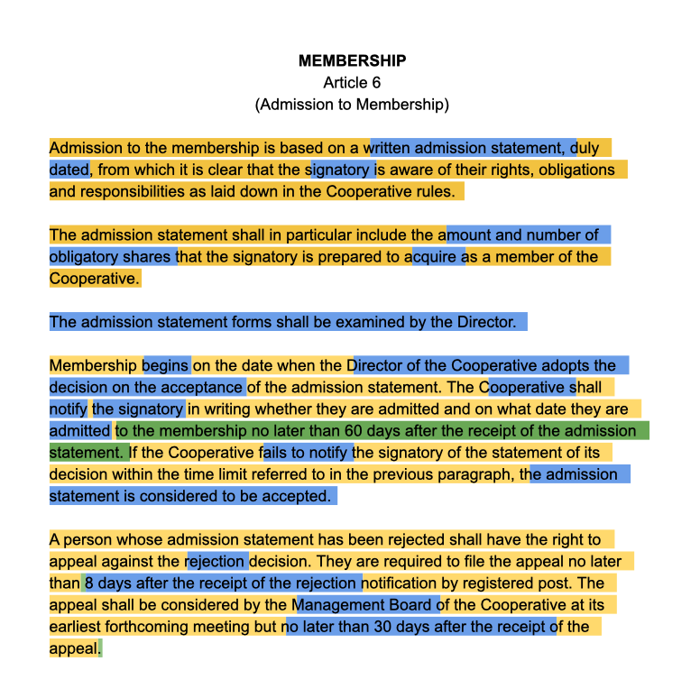
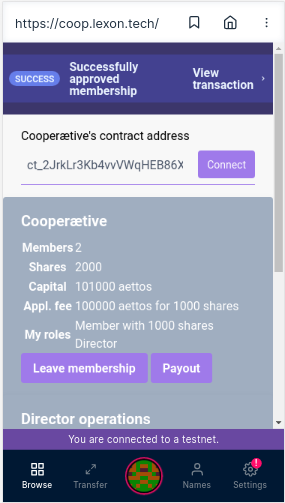

# COOP CHARTA

**1st Lexon Legal Hackathon**  
14 - 19 Sept 2019 / Cyberspace

**Aeternity Universe One Haeckathon**  
Event hosted in Prague, 14 + 15 Sept 2019

## Team

**Anja Bajl**  
**Arjan van Eersel**  
**Marina Markezic**  
**Henning Diedrich**  

## Objective

**Create a _legal_ _and_ _smart_ charta for a cooperative.**

Cooperatives are democratic, legal entities that can have a budget and own things, that allow people to buy shares in them when they become members and sell them when they quit their membership, realizing possible profits from the value increase of the cooperative.

 *A cooperative (also known as co-operative, co-op, or coop) is "an autonomous association of persons united voluntarily to meet their common economic, social, and cultural needs and aspirations through a jointly-owned and democratically-controlled enterprise".* (Statement on the Cooperative Identity. International Cooperative Alliance.)

*As a legal entity, cooperative is owned and democratically controlled by its members. Cooperative is established when the first general assembly confirms the Rules of Cooperative (a statute) which prescribe rules regarding management and more importantly the rights and responsibilities of all members. The cooperative is truly established by its members for its members and even dictates the governing principles.*

**It’s all about how we work together, right?** *In a cooperative economic benefits are distributed proportionally to each member's level of participation in the cooperative, for instance, by a dividend on sales or purchases, rather than according to the capital invested.*

**Sounds like a do-ocracy?** *It might as well be as we know many different types of cooperatives, among them is a working coop. Due to its democratic  structure and ownership of all the members, the profit-making and economic stability of a cooperative will always be balanced by the interests of the community.*

*Rules of Cooperative usually prescribe decision making process - how a member makes a proposal, how and when members can vote about these proposals, what type of quorum and threshold is needed, etc. The rules also provide the basic structure - who are cooperative members, how they gain and how they may loose such status.*

*Until now, this would mean **a lot** of paper work. One became a member when a special form, Admission to Membership, was signed and a membership fee duly payed. Now days, we might as well utilise the modern technology and automise these steps, as well as potential termination of a membership status. You wonder how? Stay tuned to Lexon and our latest Coopærative developments.*  

Lexon allows for a cooperative charta to be both a legal document and a smart contract, executable on the blockchain. This gives legal certainty in regards to joint ownership of property of the cooperative members. The DAO that is formed by the charta is a legal person that can de-facto and by rights own assets.

The general purpose of Lexon is to make the position of smart contracts stronger in the real world, off-chain. If the code of a contract is readable and clearly reflects an agreement, the incentive for anyone to sue anyone else over the actions of a smart contract is reduced: because if the human understanding of the text is the same as what was executed on the blockchain, a judge will be much less inclined to declare the IT part of it void.

This project spans the entire arc from ideating to application implementation, however, it adds a new first step, that of discussion of legal aspects and compliance. In so far as we managed to explore the legal aspects thoroughly, and spanned this hole wider arc, the project can already be counted as successful blueprint for future legal engineering hackathons.

## Result

**All bases were worked, especially:**

* a [generic cooperative charta](assets/charta.odt) for the cooperative
* a first reformulation of the [charta in Lexon](assets/charta.lex.pdf)
* [Sophia smart contract](assets/charta.aes) code as spec for Lexon
* [Vue-based DApp](src/views/Home.vue) for this basic functionality

**See below for a live walk through of the DAepp online.**

Please note that this doc is a central part of the results, on par with the DApp live demo. 

I.e. this project did not only strive to build a tangible result but serve as prototype for an approach, to join the legal and blockchain world.

In the interest of time the DAepp, as well as the Lexon and Sophia code show a modest first step, not the entire charta.

Yet, beating the complete path, even just for a functionally very reduced example, was one central premise of this project.

Eventually a DAepp as shown below, but complete, is to be created following this process.

## Sequence of Translations

**The sequence is legal > Lexon > Sophia > DApp.** 

The following screenshots illustrate the four steps and how the code evolves from legal prose, through the Lexon syntax to a Sophia smart contract and finally, finds its expression on the mobile surface of a decentralized application.

1. ### Legal

This is the marked up legal text. Find the full document [here](assets/charta.odt).

2. ### Lexon

This is the same logic as the document before but articulated in Lexon. Find the full document [here](assets/charta.lex.pdf).

3. ### Sophia

The following is the same charta gain, now articulated in Aeternity's blockchain programming language. Find the [full example](assets/charta.aes) here.

4. ### Dapp

Finally, these are screenshots from the DApp that uses the smart contract backend. You find the [source code here](src/views/Home.vue).

See below for the live walk through and explanation of the live DAepp.

## Live DAepp

#### Step 1 Open the base aepp

First of all make sure that you're connected to the testnet. Then click click on `Browse`.

#### Step 2 Connect with the aepp

Enter `https://coop.lexon.tech` in the URL bar.

#### Step 3 Register a new cooperætive

In the start screen you can either:
* Connect to an existing cooperætive
* Register a new cooperætive

The URL has a default contract address of an already deployed demo cooperætive with three members.

In this demo we'll now register a brand new cooperætive company. To from a new cooperætive three details are required:
* The amount of shares you (the founder) will take
* The default fee that new members will pay (the amount is in aettos as long as we're on the testnet)
* The amount of shares new members receive in return for their contribution

Enter your own values or accept the default values of 1000 aettos divided into 1000 shares. Click `Register` to start the registration process.

##### Step 4 Pay the capital and contract deployment fee.

Now it's time to pay. Notice that you'll pay the share capital (Amount) and the gas fee. Registering a cooperætive is in fact deploying a smart contract on the æternity blockchain. Click on `Confirm` to continue. Hold on for a few seconds while the registration takes place.

#### Step 5 Information about your new cooperætive

Congratulations! You're now director and member of a brand new cooperætive. 

In the first part of the screen you can see all the general details of the company, including your roles. This is also the screen where you'd end up after entering a contract address and clicking connect in step 3.

First copy the value which starts with `ck_` in the contract address field. This is the unique contract number of your cooperætive. We'll need this address later, so make sure you coptied it. 

#### Step 6 Director operations

As a director you have some extra options, which normal members don't have. For now you can:
* Change the registration fee and shares for new members
* Approve/reject membership applications (we'll look at this later)

Let's change the conditions for new members. Change the value for application fee to 100000 or another value and click `Set`

#### Step 7 Changing conditions for new members

Click `confirm` to commit the change to the blockchain. Notice that `amount` is now 0, that's because we're not paying any fees, but only gas for the transaction.

#### Step 8 New state

As you can see the state of the contract has changed and contains the values we set in step 7.

Let's now apply for membership. For this we'll need to use another account.

#### Step 9 Loading the contract

First click on the `Cooperætive contract address` field and pase the contract address you copied in step 5. Then click `Connect`.

#### Step 10 Applying for membership

The screen shows the general details of the company. Click on `Apply for membership`.

#### Step 11 Confirm and pay

You'll now see the screen to confirm the transaction and to pay the membership contribution. Click on `Confirm` to continue.

#### Step 12 Application pending

Everything went well and your membership is now pending. Once a director approves it you're a member. In case a director would reject your membership the smart contract will automatically return the member contribution you paid as stipulated in the contract.

For now we'll switch back to the first account, which is a director's account to approve the membership. After switching accounts, you'll have to load the contract again by pasting the contract addres and clicking `Connect`.

#### Step 13 Pending memberships

Back in the director's account you can see the pending membership application. Click on `Approve`.

#### Step 14 Confirm

Again we need to confirm the transaction.

#### Step 15 Updated state

The state of the contract is updated and our cooperætive has already 2 members.

By the way: If you click on `View transaction` in the status messages you'll be forwarded to the blockchain explorer and you can check the transaction details.

## Building

### Requirements 

* npm
* vue 
* axios
* aeternity SDK

as of 9/15/19

### Building

Install the dependencies

	npm install

Once the setup is completed you can simply run

	npm run dev

### Known issues:

* The whole contract state is being read into the aepp. This is implemented as a workaround for: https://github.com/aeternity/hackathon-prague/issues/8

## Work

Work had five phases

1. **Legal** charta:  
	As intended, the legal deliberations were held first, took up the biggest chunk of time and included more of the team than the later phases.
	1. a coop charta was analyzed and marked up, in two parallel work-streams to come to an understanding how much of the legal prose could be reasonably become automated on the blockchain, i.e. compiled to Sophia by Lexon.  
  	2. a [minimal, generic cooperative charta](assets/charta.odt) was created to serve as a starting point for the next step
  	3. research into jurisdictions - Slovenia and UK - was started to understand specific requirements especially regarding weighed votes. 

2. **Lexon** digital charta:
	1. a subset of functionality was chosen to implement during the available time horizon: foundation, member application, handling, and leaving the cooperative.
	2. [Lexon code](assets/charta.lex.pdf) was written that expresses this minimal functionality. This was dubbed 0.2.21, i.e. one step beyond the current implementation 0.2.20.

3. **Sophia** smart contract:
	1. [Sophia code](assets/charta.aes) was written that reflects the Lexon code exactly, based on the understanding of how it is generated by the Lexon compiler.
	2. The Sophia code was slightly modified to work around known issues in the full stack elements.

4. **Vue** front end:  
a [Vue front end](src/views/Home.vue) was built that incorporates the smart contracts and allows users to interact with it.

5. **Documentation** and upload

### Roadmap

The intent is to finish this project, which will take considerable resources but seems very well worth it to create a very useful template for an application of Lexon.

6. **Lexon** Compiler:  
Use Step 3 to bring the Lexon compiler to the next level.

7. **Complete Charta**:  
Iterate through the remaining articles of the legal charta to bring it on-chain. This has turned out to be a much more involved effort than anticpated.

8. **Production**
We want to work with and support who would like to use this project in production for an actual cooperative.

## Findings

* #### Deep Automation
	The share of text of a cooperative charter that can be automated to the blockchain is **unexpectedly high, at about 50%.** At the same time the effort will be much bigger than anticipated, concretely, not feasable within two days.

* #### Democratic Complexity
	The areas and modes of voting that a cooperative charter touches upon in 30 pages of text are many and they need to be articulated in more detail when expressing them in Lexon.

* #### Structural Complexity
	Even a relatively simple process like an application can ask for an act of data modelling to be expressed in Lexon. Therefore, Lexon 0.2.20 did not suffice.

* #### Clean Slate
	Because of its required document structure it did not work to insert Lexon code into the existing charter bit by bit. Instead, we resorted to a clean slate approach. The hope is that with more experience in programming Lexon, a more incremental approach might come in reach.

* #### Visual Departure
	It would seem now that a Lexon charta for a cooperative will look and be structured very different than a 'normal' charta in legal prose. This is probably owed to the higher procedural detail that Lexon requires to have spelled out and that can remain vague and much briefer in a generic (prose) template of a charta.

* #### Waffle Effect
	Many places in the charta started to look like oscillating between meaning for the blockchain and the real world. They could describe both on-chain mechanisms and at the same time be valid description of other events off-chain. **This indicates that the scope of Lexon extends beyond its intended purpose.**
    
    This "Waffle Effect" is a decidedly new phenomenon but analogous to both the fundamental abstraction of laws and object orientation in programming.

* #### Lexon passion
	Lexon is sufficiently exciting to align a group of strangers over one weekend, and navigate uncharted terrains for a very ambitious task.
    
* #### Aeternity Sophia
	The functional language Sophia is a great language to program safe smart contracts in. Different versions of documentation online and minor known issues can make life difficult, nothing that will last. The safety has the usual cost of some verbosity to achieve updates that are trivial in lesser languages.

* #### Aeternity maturity
	Aeternity and its ecosystem turns out to be mature enough to deploy production-level projects. The engineering that can be observed when looking under the hood is impressive, including the implementation of its virtual machine. Encountered problems tend to misunderstandings. The very fact that outdated links and docs get in the way points to the steady progress that is happening.

## Resources

* Coop Chart Dapp Live Demo  
  * see above for link and explanation  

* Lexon Online Editor  
  * http://3.lexon.tech  

* Sophia Online Editors  
  * we used https://testnet.contracts.aepps.com  
  * alternative: http://fireeditor.nikitafuchs.de  
    

* Sophia off-line compiler  
  * minimal overhead: https://github.com/aeternity/aesophia_cli  

## License

    LEXON COOP CHARTA PROJECT

    Copyright (C) 2019  Anja Bajl, Arjan van Eersel, Marina Markezic, 
                        Henning Diedrich

    This program is free software: you can redistribute it and/or modify
    it under the terms of the GNU General Public License as published by
    the Free Software Foundation, either version 3 of the License, or
    (at your option) any later version.

    This program is distributed in the hope that it will be useful,
    but WITHOUT ANY WARRANTY; without even the implied warranty of
    MERCHANTABILITY or FITNESS FOR A PARTICULAR PURPOSE.  See the
    GNU General Public License for more details, in file LICENSE.md.

